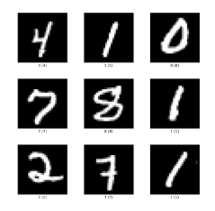

# 6️⃣ Dígitos - Redes Neuronales 🧠

  

El proyecto se llevó a cabo en el marco del curso de Redes Neuronales dictado por la Fundación Tarpuy en el año 2023. 

# Objetivo del proyecto
Desarrollar un modelo de clasificación de dígitos manuscritos utilizando una red neuronal convolucional (CNN) implementada en TensorFlow.

# Información General
- **Tutor**: Leandro Borgnino
- **Participantes**:
    - Alvaro Santiago Medina

# Descripción
El proyecto consiste en desarrollar un modelo de clasificación de dígitos a partir de un dataset de imágenes (como MNIST). Para ello, se utilizará una red neuronal implementada en TensorFlow, diseñada específicamente para identificar números del 0 al 9.

# Dataset
Como se ha mencionado anteriormente, se utilizará el dataset llamado MNIST.

# Código
El código del proyecto más el detalle de cada parte se encuentra en el archivo [`Digitos.ipynb`](./Digitos.ipynb).

# Referencias
- [MNIST](http://yann.lecun.com/exdb/mnist/)
- [TensorFlow](https://www.tensorflow.org/)
- [Keras](https://keras.io/)
